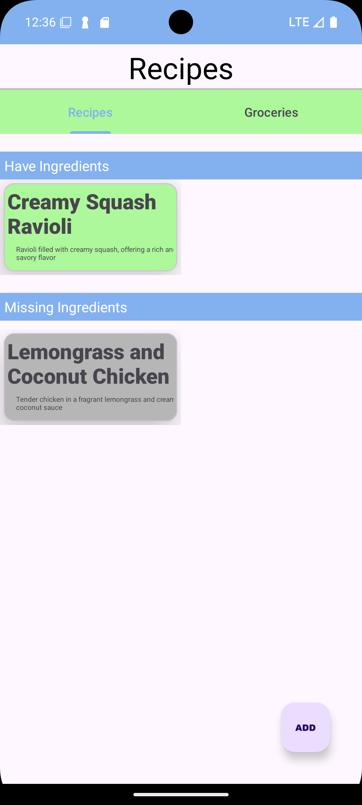
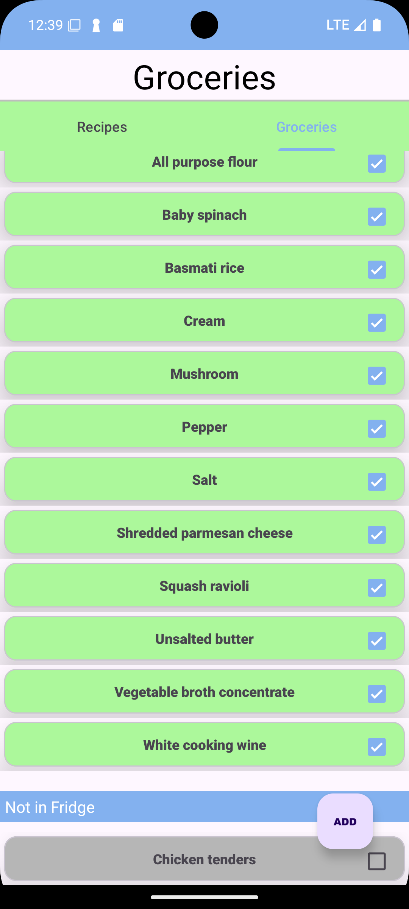
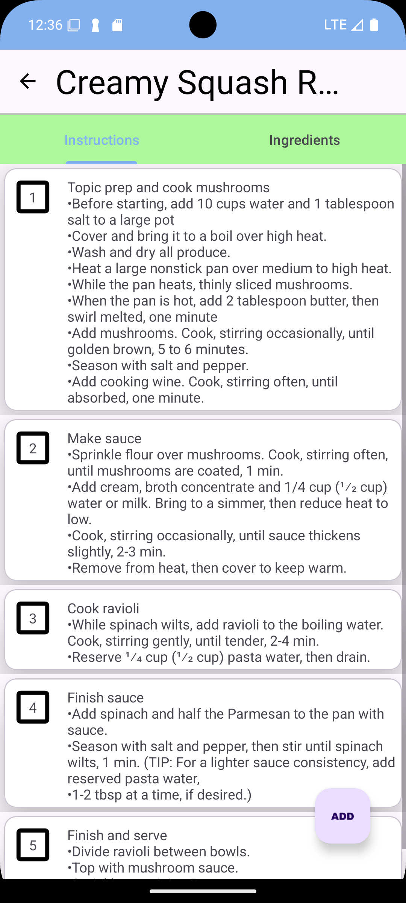
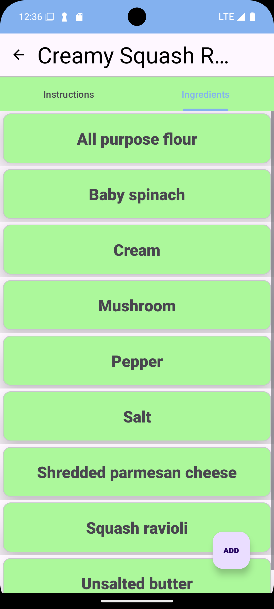
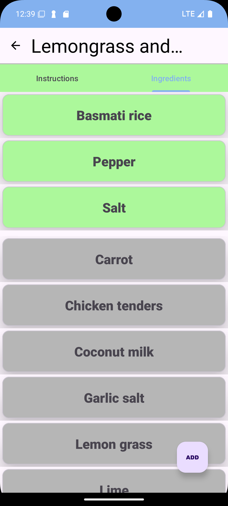

# What Can We Eat
What Can We Cook is designed to help organize a growing recipe list and let you know what you can cook based on the ingredients you have at home!

## Features
It is still being updated and will feature many more functionalities in the future. But as of now, the app is running as intended.
- Add/Remove your own Recipes and Descriptions
- Add/Remove your own recipe instructions & Ingredients
- Add/Remove Groceries
- Check/Uncheck Groceries
- 2 Recipes pre-programmed in

## Future Updates
- Uploading Instructional Video's for Follow Alongs
- Uploading Images for Ingredients or Prep
- Color when missing 1-3 items
- More Features
- Design Improvements

 ## Snapshots
 While the app needs a re-design, the functionality is very easy. Adding, Editing, Deleting are all possible to help you start organizing your recipes today!

 ### Whether you want to: 
 - Add Recipes

 &nbsp;&nbsp;

- Add Groceries You've Bought

 

- Check Out Recipes You Can Make
- Check Out The Steps To Make Your Recipe
- Check Out What Ingredients You Need!
- Even Update The Recipe!

&nbsp;&nbsp;

- Even Check What Ingredients Your Missing!

